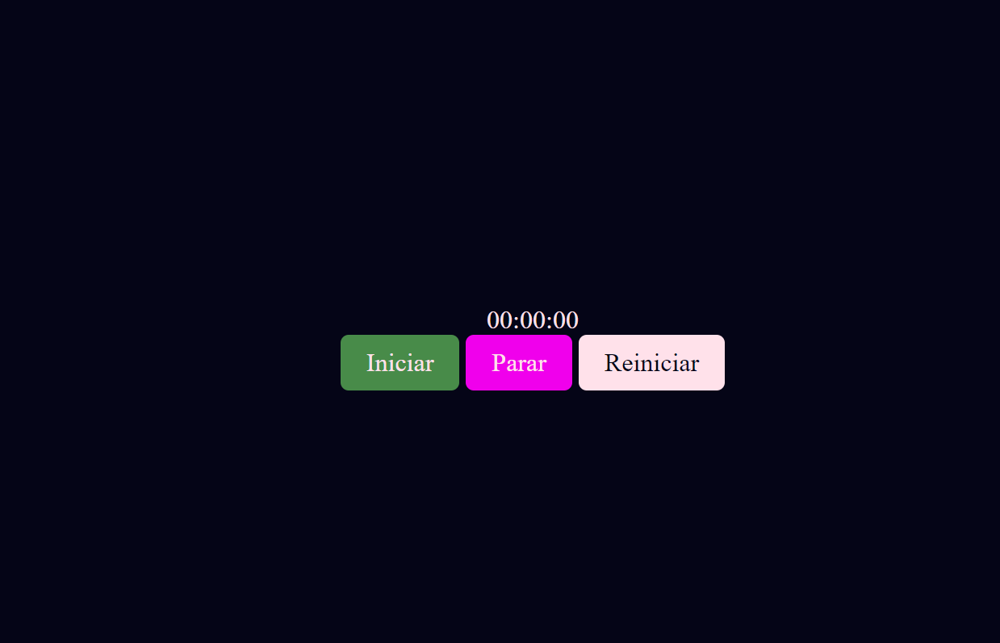
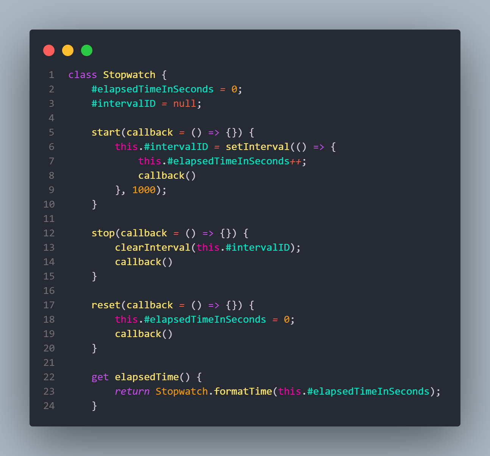
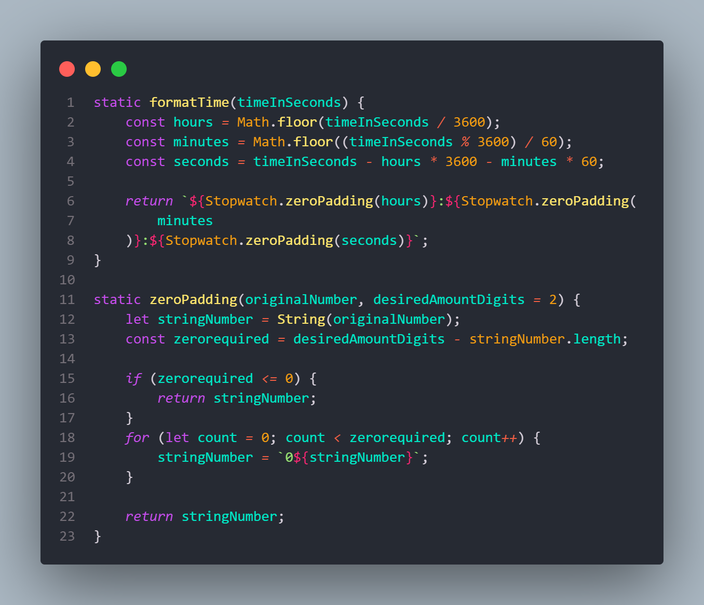

<h1> Olá este é um projeto de estudo de class no javaScript, bem básico. </h1>

<h2>A classs criada é StopWatch (cronometro) - ela possui metodos, propriedades, getter e setter e membros Privados. </h2>

 Por mais que o projeto seja simples e didatico, serviu de muito aprendizado para a criação de classses e a mamipulação dela 

 </img>

<h2> Ela possui 3 botões que manipulam o StopWatch atraves das propriedades Start, Stop e Reset. </h2>

 Além disso, o tempo e o intervalo só podem ser alterados por ordens de dentro da class, já que seus valores são privados. 

</img>

<h3> Também foi implementado metodos estaticos, que servem à função classe e não a variável, ou seja, caso queira formatar outro tempo, o metodo deve ser chamadoo através da classe. <h3>

 Ex: Stopwatch.formatTime() ao invés de sw1.formatTime() 

</img>

<h3>Muito obrigado pela Atenção !! <h3>
